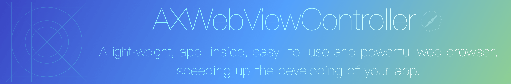

[](http://cocoapods.org/pods/AXWebViewController)[](http://cocoapods.org/pods/AXWebViewController)[](http://cocoapods.org/pods/AXWebViewController)


## Summary

`AXWebViewController`是一款易用的基于`UIWebView`（20160716更新：iOS8.0以上使用`WKWebView`实现）封装的网页浏览控制器. 在系统功能的基础上添加了工具条导航，可以刷新、返回、前进、等操作，同时，`AXWebViewController`还实现了`微信样式`的导航返回支持，集成简单，使用方便。如图所示：

[](http://ww3.sinaimg.cn/large/d2297bd2gw1f5wpniezqpg209o0h44qr.gif)	[](http://ww4.sinaimg.cn/large/d2297bd2gw1f5wpmh7vfgg209o0h4qv5.gif)

[视频链接](http://video.weibo.com/show?fid=1034:5a4102ad40573447a44ae74d56a80451)
## Features
>* 手势滑动返回上个网页
>* 微信样式导航返回
>* 网页加载失败提示（iOS8.0以下）
>* 网页加载进度提示
>* 网页来源提示
>* 支持__Peek__和__Pop__浏览网页，并且commit之后在本网页进行加载，不用跳转到Safari进行浏览，这里使用到了很多运行时的方法，因此，在使用的过程中可能会抛异常。

## Requirements

`AXWebViewController` 对系统版本支持到iOS7.0，需要使用到：

>* Foundation.framework
>* UIKit.framework

使用的时候最好使用最新版Xcode。

## Adding AXWebViewController to your projet
### CocoaPods
[CocoaPods](http://cocoapods.org) is the recommended way to add AXWebViewController to your project.

1. Add a pod entry for AXPopoverView to your Podfile `pod 'AXWebViewController', '~> 0.1.10'`
2. Install the pod(s) by running `pod install`.
3. Include AXPopoverView wherever you need it with `#import "AXWebViewController.h"`.

### Source files

Alternatively you can directly add the `AXWebViewController.h`、`AXWebNavigationViewController.h` and `AXWebViewController.m`、`AXWebNavigationViewController.m` source files to your project.

1. Download the [latest code version](https://github.com/devedbox/AXWebViewController/archive/master.zip) or add the repository as a git submodule to your git-tracked project. 
2. Open your project in Xcode, then drag and drop `AXWebViewController.h` and `AXWebViewControllerm` onto your project (use the "Product Navigator view"). Make sure to select Copy items when asked if you extracted the code archive outside of your project. 
3. Include AXPopoverView wherever you need it with `#import "AXWebViewController.h"`.

## License

This code is distributed under the terms and conditions of the [MIT license](LICENSE). 

## Usage

`AXWebViewController`使用和使用普通`UIViewController`一样简单，只需要在需要使用的地方使用`URL`初始化即可：
```objcetive-c
AXWebViewController *webVC = [[AXWebViewController alloc] initWithAddress:@"http://www.baidu.com"];
webVC.showsToolBar = NO;
webVC.navigationController.navigationBar.translucent = NO;
self.navigationController.navigationBar.tintColor = [UIColor colorWithRed:0.100f green:0.100f blue:0.100f alpha:0.800f];
self.navigationController.navigationBar.barTintColor = [UIColor colorWithRed:0.996f green:0.867f blue:0.522f alpha:1.00f];
[self.navigationController pushViewController:webVC animated:YES];
```
### 使用工具条导航
使用工具条只需在`AXWebViewController`初始化之后加入一句代码：
```objcetive-c
webVC.navigationType = AXWebViewControllerNavigationToolItem;
webVC.showsToolBar = YES;
```
注意，在设置`navigationType`为`AXWebViewControllerNavigationToolItem`之后，须确认`showsToolBar`为`YES`才能生效.
### 使用微信样式导航
在`AXWebViewController`初始化之后加入一句代码：
```objcetive-c
webVC.navigationType = AXWebViewControllerNavigationBarItem;
```
即可生效.
### Peek&Pop
Peek和Pop使用的是原生的系统功能，在使用的时候只需要将`webView.allowsLinkPreview`设置为`YES`即可使用，这里需要注意下，在实现Peek和Pop的时候，使用了Runtime的相关知识，而且使用AOP的一个框架__[Aspects](https://github.com/steipete/Aspects)__进行了编程，在使用的过程中可能会出错，当然，出错的几率也是很小的（苹果不可能隔三差五的去修改自家的Private API吧=  =），实现原理就不多讲了，基本上就是运行时的一些知识，代码如下：
```objcetive-c

- (void)hookWebContentCommitPreviewHandler {
    // Find the `WKContentView` in the webview.
    __weak typeof(self) wself = self;
    for (UIView *_view in _webView.scrollView.subviews) {
    if ([_view isKindOfClass:NSClassFromString(@"WKContentView")]) {
    id _previewItemController = object_getIvar(_view, class_getInstanceVariable([_view class], "_previewItemController"));
    Class _class = [_previewItemController class];
    SEL _performCustomCommitSelector = NSSelectorFromString(@"previewInteractionController:interactionProgress:forRevealAtLocation:inSourceView:containerView:");
    [_previewItemController aspect_hookSelector:_performCustomCommitSelector withOptions:AspectPositionAfter usingBlock:^() {
        UIViewController *pred = [_previewItemController valueForKeyPath:@"presentedViewController"];
        [pred aspect_hookSelector:NSSelectorFromString(@"_addRemoteView") withOptions:AspectPositionAfter usingBlock:^() {
            UIViewController *_remoteViewController = object_getIvar(pred, class_getInstanceVariable([pred class], "_remoteViewController"));
            
            [_remoteViewController aspect_hookSelector:@selector(viewDidLoad) withOptions:AspectPositionAfter usingBlock:^() {
                _remoteViewController.view.tintColor = wself.navigationController.navigationBar.tintColor;
            } error:NULL];
        } error:NULL];
        
        NSArray *ddActions = [pred valueForKeyPath:@"ddActions"];
        id openURLAction = [ddActions firstObject];
        
        [openURLAction aspect_hookSelector:NSSelectorFromString(@"perform") withOptions:AspectPositionInstead usingBlock:^ () {
            NSURL *_url = object_getIvar(openURLAction, class_getInstanceVariable([openURLAction class], "_url"));
            [wself loadURL:_url];
        } error:NULL];
        
        id _lookupItem = object_getIvar(_previewItemController, class_getInstanceVariable([_class class], "_lookupItem"));
        [_lookupItem aspect_hookSelector:NSSelectorFromString(@"commit") withOptions:AspectPositionInstead usingBlock:^() {
            NSURL *_url = object_getIvar(_lookupItem, class_getInstanceVariable([_lookupItem class], "_url"));
            [wself loadURL:_url];
        } error:NULL];
        [_lookupItem aspect_hookSelector:NSSelectorFromString(@"commitWithTransitionForPreviewViewController:inViewController:completion:") withOptions:AspectPositionInstead usingBlock:^() {
            NSURL *_url = object_getIvar(_lookupItem, class_getInstanceVariable([_lookupItem class], "_url"));
            [wself loadURL:_url];
        } error:NULL];
        /*
         UIWindow
         -UITransitionView
         --UIVisualEffectView
         ---_UIVisualEffectContentView
         ----UIView
         -----_UIPreviewActionSheetView
         */
        /*
         for (UIView * transitionView in [UIApplication sharedApplication].keyWindow.subviews) {
         if ([transitionView isMemberOfClass:NSClassFromString(@"UITransitionView")]) {
         transitionView.tintColor = wself.navigationController.navigationBar.tintColor;
         for (UIView *__view in transitionView.subviews) {
         if ([__view isMemberOfClass:NSClassFromString(@"UIVisualEffectView")]) {
         for (UIView *___view in __view.subviews) {
         if ([___view isMemberOfClass:NSClassFromString(@"_UIVisualEffectContentView")]) {
         for (UIView *____view in ___view.subviews) {
         if ([____view isMemberOfClass:NSClassFromString(@"UIView")]) {
         __weak typeof(____view) w____view = ____view;
         [____view aspect_hookSelector:@selector(addSubview:) withOptions:AspectPositionAfter usingBlock:^() {
         for (UIView *actionSheet in w____view.subviews) {
         if ([actionSheet isMemberOfClass:NSClassFromString(@"_UIPreviewActionSheetView")]) {
         break;
         }
         }
         } error:NULL];
         }
         }break;
         }
         }break;
         }
         }break;
         }
         }
         */
    } error:NULL];
    break;
    }
    }
}

```

## 致谢
[RxWebViewController](https://github.com/Roxasora/RxWebViewController)为我提供了思路，有些地方做了参考

使用了[NJKWebViewProgress](https://github.com/ninjinkun/NJKWebViewProgress)作为进度条，感谢！
## 更新日志
### 0.1.10 
使用基于`UIWebView`的实现，进度条使用`NJKWebViewProgress`实现.
### 0.2.0
iOS8.0以上使用`WKWebView`实现，进度条使用`UIProgressView`实现. 实现了本页面Peek&Pop而不用跳转到Safari进行浏览.
### 0.3.0
使用[AXNavigationBackItemInjection](https://github.com/devedbox/AXNavigationBackItemInjection)实现微信导航样式，也可以自定义返回的操作，只需要几行代码就可以搞定！
#### 查看更多日志请移步[`Latest release`](https://github.com/devedbox/AXWebViewController/releases/latest).
